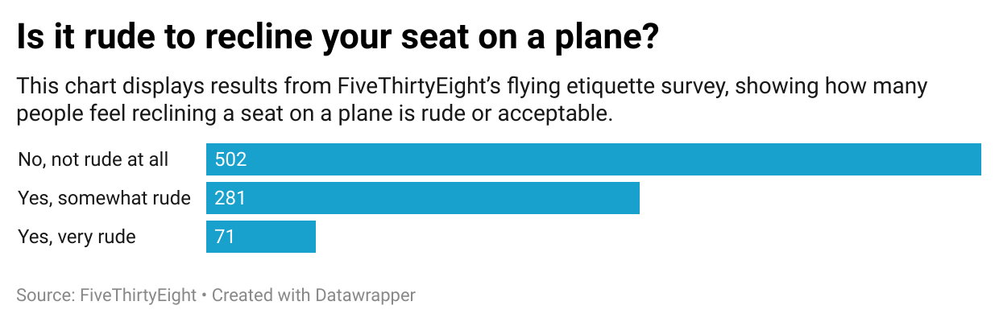

# Is It Rude to Recline Your Seat on a Plane?

This repository contains a chart based on data from FiveThirtyEight’s flying etiquette survey. I selected the question about reclining seats because it  reflects a common social dilemma during air travel. I’ve been on flights where people recline their seats and I wanted to know what most people think about it. The results were interesting because they showed how many people are okay with it and how many think it’s rude.

## Chart Summary
- **502** people said it's *not rude at all*
- **281** said it's *somewhat rude*
- **71** said it's *very rude*

This indicates that while most are okay with reclining, a sizable group finds it inconsiderate.

## Chart

## Data Source
[FiveThirtyEight Flying Etiquette Survey](https://github.com/fivethirtyeight/data/tree/master/flying-etiquette-survey)
